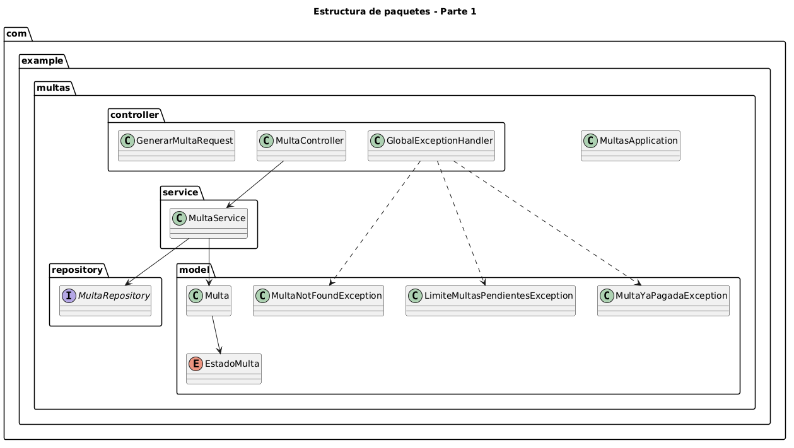

# Post-contenido — Unidad 7: Patrones Arquitectónicos I

## Descripción
Repositorio del post-contenido de la Unidad 7 de Patrones de Diseño
de Software. Un unico proyecto Spring Boot (multas-biblioteca-api)
para la gestion de multas de biblioteca, con dos partes: una API REST
en capas (Model, Repository, Service, Controller) sobre H2, y pago en
linea de multas con dos pasarelas intercambiables.

## Parte 1 — Arquitectura en Capas
MultaRepository extiende JpaRepository y agrega una consulta
agregada (countByEstudianteIdAndEstado). MultaService concentra las
reglas de negocio (limite de multas pendientes, generacion); el
calculo del monto vive en la propia entidad Multa
(Multa.calcularMonto). MultaController expone /api/multas. Ver
paquetes model/, repository/, service/ y controller/.

## Parte 2 — Pago en Linea con Dos Pasarelas
Para la incorporación del pago en línea se eligió la **Opción C: Puerto de dominio con dos adaptadores**, aplicando arquitectura hexagonal únicamente en la porción del sistema relacionada con las pasarelas de pago. La decisión se tomó porque PagosUDES y Wompi exponen contratos HTTP diferentes y el sistema debe poder intercambiar el proveedor activo mediante configuración, sin modificar `MultaController` ni la lógica de negocio de `MultaService`. Introducir un puerto de salida permite aislar estas diferencias tecnológicas y mantener al núcleo de la aplicación independiente de los proveedores concretos.

El contrato común se define mediante `domain/port/PasarelaPagoPort`, mientras que `domain/ResultadoPago` representa un resultado neutral para cualquier proveedor. Ambos componentes pertenecen al dominio y están implementados en Java puro, sin dependencias de Spring, `RestTemplate` ni otros clientes HTTP. Las implementaciones concretas se encuentran en la capa de infraestructura:

- `infrastructure/pago/PagosUdesAdapter`: adapta el contrato de PagosUDES, que utiliza `idTransaccion` y `estadoTransaccion`.
- `infrastructure/pago/WompiAdapter`: adapta el contrato de Wompi, que utiliza `reference`, `status` y requiere enviar el monto en centavos.

Cada adaptador traduce la respuesta específica del proveedor al mismo objeto `ResultadoPago`, evitando que los DTO o conceptos propios de las pasarelas se filtren hacia `MultaService`. La selección del proveedor activo se realiza mediante la propiedad:

**properties**
**app.pagos.proveedor=pagosudes**

## Cómo ejecutar
```
$ cd multas-biblioteca-api && mvn spring-boot:run
```

## Herramientas utilizadas
- Java 17, Spring Boot 3.x, Spring Data JPA, H2, RestTemplate
- Apache Maven, Postman/curl, Git, GitHub

## Decisiones de diseño

### Punto de decisión 1 — Cálculo del monto: ¿entidad o Service?
Se decidió ubicar calcularMonto en la entidad Multa porque la regla depende exclusivamente de información propia del dominio: los días de atraso, el valor cobrado por día y el tope máximo permitido. No requiere consultar un repositorio, consumir un servicio externo ni coordinar otros componentes.

Ubicar esta lógica en MultaService sería técnicamente posible, pero reduciría progresivamente la entidad a una estructura pasiva de datos. El resultado sería un modelo anémico, en el que las reglas relacionadas conceptualmente con una multa estarían dispersas en servicios externos a la propia entidad.

Mantener la operación en Multa mejora la cohesión: el objeto que representa el concepto del negocio también conoce una de sus reglas fundamentales. Además, cualquier otro caso de uso que necesite calcular el monto puede reutilizar la regla sin depender artificialmente de MultaService.

### Punto de decisión 2 — Conteo de multas pendientes: ¿consulta o filtrado en memoria?
La restricción que impide que un estudiante acumule más de tres multas pendientes necesita información persistida. Por esta razón, la decisión de negocio se encuentra en MultaService, pero el dato requerido se obtiene mediante: **countByEstudianteIdAndEstado(...)** en MultaRepository.

Se descartó recuperar todas las multas del estudiante y posteriormente filtrarlas mediante Streams de Java porque ese enfoque trasladaría innecesariamente datos desde la base de datos hacia la memoria de la aplicación. Una operación COUNT ejecutada por el motor de base de datos solamente devuelve el valor que necesita la regla de negocio. Esta diferencia sería especialmente importante si el historial de un estudiante contuviera cientos o miles de multas.

Por tanto, la separación adoptada es deliberada: el Repository obtiene eficientemente el dato; el Service toma la decisión de negocio usando ese dato.

## Estructura de paquetes — Parte 1

La primera parte del proyecto se organiza siguiendo arquitectura en capas. 
El paquete `controller` concentra la capa de presentación y expone los endpoints REST. 
El paquete `service` implementa la lógica de aplicación y coordina los casos de uso. 
El paquete `model` contiene la entidad del dominio y las excepciones de negocio. 
El paquete `repository` encapsula el acceso a datos mediante Spring Data JPA.

## Diagrama de estructura de paquetes — Parte 1



### Punto de decisión 3 — Selección del adaptador activo
Para seleccionar el proveedor se utilizó @ConditionalOnProperty.
Ejemplo:
@ConditionalOnProperty(
    prefix = "app.pagos",
    name = "proveedor",
    havingValue = "pagosudes"
)

Con esta estrategia únicamente existe en el contexto de Spring la implementación de PasarelaPagoPort correspondiente al proveedor configurado. En consecuencia, MultaService recibe exactamente una implementación del puerto mediante inyección por constructor. Se consideró como alternativa inyectar: Map<String, PasarelaPagoPort> y seleccionar el proveedor en tiempo de ejecución.

Esta alternativa ofrece mayor flexibilidad si la pasarela tuviera que decidirse individualmente para cada transacción. Sin embargo, el requisito indica que cada sede utiliza una pasarela configurada para su despliegue. No se requiere cambiar de proveedor en medio de la ejecución. Usar un Map en este contexto habría trasladado al Service responsabilidades adicionales: conocer nombres o claves de proveedores y ejecutar lógica de selección. Por eso @ConditionalOnProperty representa la solución más acorde con el requerimiento actual.

### Punto de decisión 4 — Diseño del puerto y el tipo de resultado
PasarelaPagoPort devuelve: ResultadoPago, en lugar de retornar directamente un DTO de PagosUDES o Wompi. Esto es necesario porque las dos APIs externas presentan contratos diferentes. PagosUDES utiliza conceptos como:idTransaccion, estadoTransaccion; mientras Wompi utiliza: reference y status.

Además, Wompi expresa los valores monetarios en centavos. Los adaptadores absorben estas diferencias y las traducen hacia un lenguaje común: 

proveedor
exitoso
referenciaExterna
mensaje

Si PasarelaPagoPort devolviera PagosUdesResponse, entonces el dominio dependería conceptualmente de PagosUDES y WompiAdapter tendría que adaptar artificialmente sus propios conceptos a nombres pertenecientes a otro proveedor.

Por ejemplo, un atributo llamado:

idTransaccion

No sería realmente neutral porque Wompi devuelve una reference. La abstracción referenciaExterna representa mejor el concepto compartido por ambas tecnologías. Gracias a esta decisión es posible incorporar en el futuro:

MercadoPagoAdapter
PayUAdapter
StripeAdapter

Sin modificar el contrato utilizado por MultaService, siempre que puedan traducir sus respuestas a ResultadoPago.

### Trade-off considerado — Parte 2
La incorporación del puerto PasarelaPagoPort y los adaptadores añade más estructura que una implementación puramente en capas. La solución requiere una interfaz adicional, un modelo de resultado neutral, un paquete de dominio y clases adaptadoras específicas. Por tanto, su costo inmediato es un mayor número de archivos, más líneas de código y una arquitectura que exige comprender inversión de dependencias y puertos y adaptadores.

Una alternativa más sencilla habría sido implementar directamente las llamadas a PagosUDES y Wompi desde MultaService, posiblemente mediante un if o switch. Esa opción tendría menos código inicialmente, pero haría que el servicio conociera URLs, formatos HTTP, unidades monetarias y modelos de respuesta propios de cada pasarela. Cada nuevo proveedor aumentaría la cantidad de condiciones y responsabilidades del servicio.

También era posible mantener una arquitectura estrictamente en capas utilizando una interfaz Strategy en service/. Esa alternativa resolvería parte del problema de intercambiabilidad, pero mantendría conceptualmente la integración externa dentro de la capa de aplicación. El puerto escogido expresa de manera más explícita que el núcleo necesita la capacidad de procesar un pago, mientras que la tecnología concreta encargada de realizarlo pertenece a infraestructura.

La solución hexagonal se aplicó exclusivamente al pago, no a toda la aplicación. Migrar MultaRepository, MultaController y el resto del proyecto a una arquitectura hexagonal completa habría introducido complejidad que el alcance actual no justifica.

Si en el futuro terminara el piloto, desapareciera la posibilidad de cambiar de proveedor y la aplicación quedara permanentemente integrada con una sola pasarela extremadamente estable, el equipo podría reconsiderar si mantener toda esta abstracción sigue generando valor. En el escenario actual, donde existen dos contratos externos distintos y se contempla que proveedores puedan agregarse o eliminarse, la separación mediante puerto y adaptadores tiene una justificación concreta.

## Conclusiones
La actividad permitió comprobar que utilizar patrones arquitectónicos no consiste en migrar todo un sistema a una arquitectura más compleja, sino en identificar dónde existe una necesidad real de separación. La arquitectura en capas resultó suficiente para los casos de uso básicos de multas, mientras que la integración con dos proveedores externos creó una variación tecnológica que justificó introducir un puerto y adaptadores únicamente en la porción de pago. La solución también evidenció la importancia de mantener las reglas del dominio cerca de los objetos que representan y de utilizar la infraestructura para resolver detalles técnicos externos. Finalmente, la decisión arquitectónica se fundamentó en los cambios esperados del sistema y no solamente en la posibilidad técnica de aplicar un patrón.